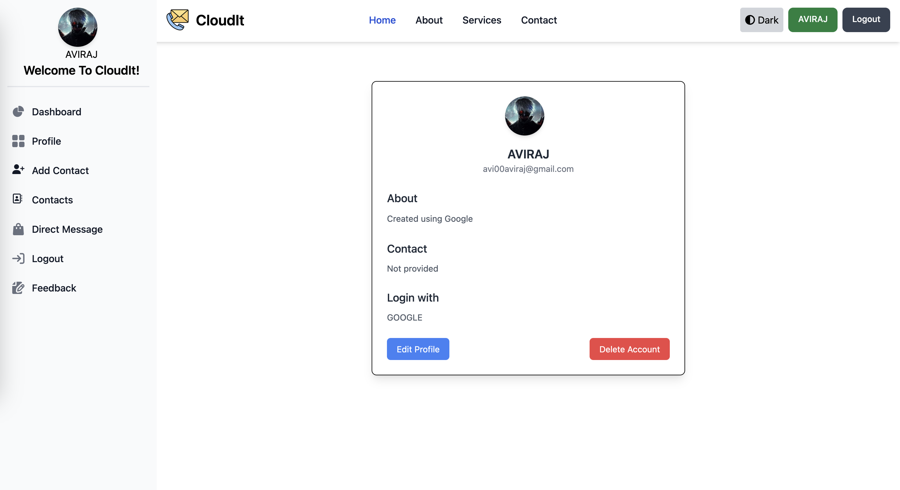

# Cloudit - Contact Manager Web App
*A simple and efficient contact management system*

## 🚀 About the Project
Cloudit is a web-based contact manager that allows users to securely store, manage, and retrieve their contacts. Built with **Spring Boot** for the backend and deployed using **AWS EC2 and Docker**, Cloudit ensures scalability and ease of use.

## 🛠 Tech Stack
- **Backend:** Spring Boot
- **Database:** MySQL (Hosted on AWS or EC2 instance)
- **Frontend:** HTML, CSS (or React, if applicable)
- **Deployment:** AWS EC2, Docker
- **Containerization:** Docker
- **Reverse Proxy:** Nginx (if used)

## 🎯 Features
✅ User Authentication (Login & Signup)  
✅ Add, Edit, Delete Contacts  
✅ Search and Filter Contacts  
✅ Secure Data Storage in MySQL  
✅ Responsive UI  
✅ Deployed on AWS EC2 using Docker  

## 📦 Setup & Installation
### Prerequisites
- Java 17+ installed
- Docker installed
- MySQL database set up
- AWS EC2 instance ready

### Clone the Repository
```bash
 git clone https://github.com/your-username/cloudit.git
 cd cloudit
```

### Backend Setup
1. Configure `application.properties` for MySQL connection.
2. Build the Spring Boot application:
```bash
mvn clean package
```
3. Run locally:
```bash
java -jar target/cloudit.jar
```

### Docker Setup
1. Build the Docker image:
```bash
docker build -t cloudit-app .
```
2. Run the container:
```bash
docker run -d -p 8080:8080 cloudit-app
```

### Deployment on AWS EC2
1. SSH into your EC2 instance:
```bash
ssh -i your-key.pem ec2-user@your-ec2-ip
```
2. Pull the Docker image (if using Docker Hub):
```bash
docker pull your-dockerhub-username/cloudit-app
```
3. Run the container:
```bash
docker run -d -p 80:8080 your-dockerhub-username/cloudit-app
```
4. Access the app in your browser: `http://your-ec2-ip`

## 📷 Screenshots
  
_Add screenshots of your app interface_

## 🛡 Security Enhancements
- Implement **JWT authentication**
- Host the database using **AWS RDS**(optional)

## 📜 License
This project is licensed under the MIT License - see the [LICENSE](LICENSE) file for details.
---
*Made with ❤️ by [Aviraj](https://github.com/aviraj00)*

